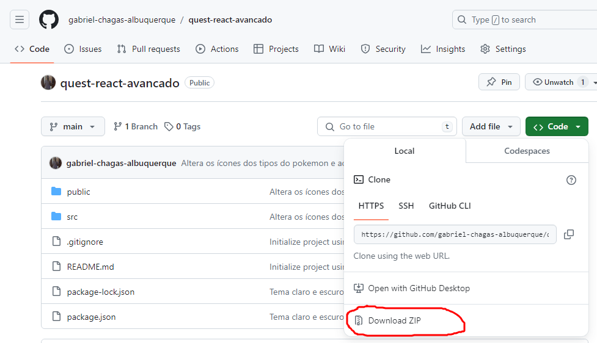

# Projeto Pokedex
Se trata de uma página que mostra uma lista de pokemons contendo nome, imagem e tipos do pokemon, ao clicar no pokemon, o usuário é levado para outra página, onde possui informações sobre as habilidades e os movimentos do pokemon

## Propósito do Projeto
Esse projeto foi realizado com o propósito de exercitar minhas habilidades em React, me permitindo aprender o React de maneira prática.

## Funcionalidades

- **Botão "Mostrar Mais"**, inicialmente, a página mostra 10 pokemons, cada vez que o usuário clica no botão mostrar mais, a página mostra mais 10 pokemons, até que não tenha mais pokemons para mostrar

- **Botão para Alternar entre os temas claro e escuro**, no menu, possui um ícone de um sol ou uma lua, clica nesse botão irá alternar o tema da página entre claro e escuro

- **Filtros de busca dos pokemons por nome e tipo**, o usuário pode fazer uma busca por algum ou alguns pokemons em específico digitando seu nome, ou selecionando o tipo do pokemon

## Ferramentas Utilizadas

- **React-router-dom** -> Para criar as rotas da página, deixando a aplicação uma Single Page Aplication (SPA), o que, na prática, faz com que a navegação na página seja mais fluida.

- **Style-components** -> Essa biblioteca serve para facilitar a estilização de componentes React, permitindo um código mais organizado e uma estilização mais eficiente e produtiva

- **Font Awesome** -> O Font Awesome foi utilizado para obter os ícones do botão de alternar o tema entre claro e escuro

## Passo-a-passo Instalação e execução do projeto
### Download do arquivo zip do projeto ou usar um git clone
- Clique no botão **Code**
#### Download do Arquivo Zip
- Clique no botão circulado abaixo



- Abrir um terminal na pasta do projeto que foi baixada ou, no caso do VSCode, você pode abrir o projeto no VSCode e usar o terminal através do VSCode

- Digitar os seguintes comandos:
```
npm install 
npm start  
```
#### Git Clone
- Copiar o link clicando no botão marcado na imagem abaixo


- Abrir um terminal na pasta onde você pretende colocar o projeto

- Digitar os seguintes comandos
```
git clone *link copiado*
cd *nome do projeto*
npm install
npm start
```

